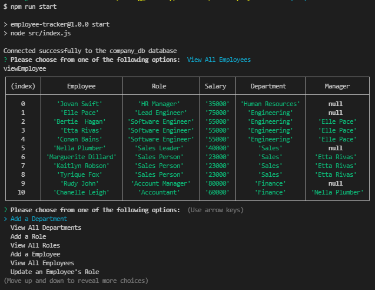

# **Employee Tracker** 

# Table of Contents

## 1. [Description](#introduction)

## 2. [Technologies Used](#technologies-used)

## 3. [Packages Used](#packages-used)

## 4. [User Flow](#user-flow)

## 5. [Invoke Application](#invoke-application)

## 6. [Tests](#tests)

## 7. [Demo](#demo)

#

# Description

I have been approached to create a **Content Management System (CMS)** interface in order to allow non-developers to easily view and interact with information stored in a database.

This project will all non-developers within a company to, easily add, view, delete and calculate rows/columns within a databases table. Users will be able to create Departments, Roles that are linked to a department and Employees that are linked to a specific role. Below you can see an ERD diagram representing those relationships.

# Demo of Employee Tracker CMS



https://watch.screencastify.com/v/tDrlYQLS48YKydB8TfC1

# Technologies Used

- JavaScript
- Node.js
- SQL

## Packages/Modules Used

- Express
- Inquirer
- MySQL2
- console.table

# User Flow

```md
GIVEN a command-line application that accepts user input
WHEN I start the application
THEN I am presented with the following options: view all departments, view all roles, view all employees, add a department, add a role, add an employee, and update an employee role

WHEN I choose to view all departments
THEN I am presented with a formatted table showing department names and department ids

WHEN I choose to view all roles
THEN I am presented with the job title, role id, the department that role belongs to, and the salary for that role

WHEN I choose to view all employees
THEN I am presented with a formatted table showing employee data, including employee ids, first names, last names, job titles, departments, salaries, and managers that the employees report to

WHEN I choose to add a department
THEN I am prompted to enter the name of the department and that department is added to the database

WHEN I choose to add a role
THEN I am prompted to enter the name, salary, and department for the role and that role is added to the database

WHEN I choose to add an employee
THEN I am prompted to enter the employee’s first name, last name, role, and manager, and that employee is added to the database

WHEN I choose to update an employee role
THEN I am prompted to select an employee to update and their new role and this information is updated in the database
```

# Getting Started

## Install Application

```
git clone git@github.com:DarionRichards/employee-tracker.git
cd employee-tracker
npm i
```

## Start Application

```
npm run start
```

# Tests

Tests were not required.

# License


